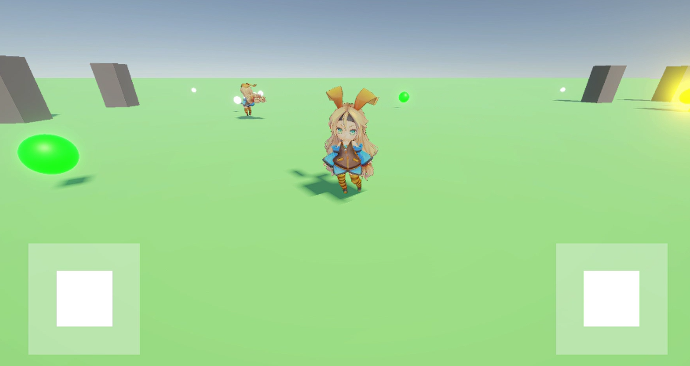

# LudPlusGames
## 概要
PhotonFusionを使用してオンライン対戦に対応したアクションゲーム集です。
複数のゲームを用意する予定で、共通化できる部分と各ゲームに依存した処理に分かれてます。

※本プロジェクトは現在開発中です(制作期間：4日、2025年5月7日時点)

## 開発環境
- Unity 6(6000.0.23f1)
- C#
- PhotonFusion 2.0.5
- UniTask
- R3

## 動作サンプル
- [プレイ動画](https://youtu.be/psk2bV8z5lI)
- スクリーンショット
  - 

## 確認手順
- プロジェクトをクローン
- Unityでプロジェクトをオープン
- **PhotonFusion 2.0.5** をインポート
- PhotonAppSettingsに、**App Id Fusion** を設定

## 操作説明
- 左スティック(PCではキーボードの WASD でも操作可能)
  - キャラクタ操作
- 右スティック(PCではキーボードの ↑↓←→ でも操作可能)
  - カメラ操作

